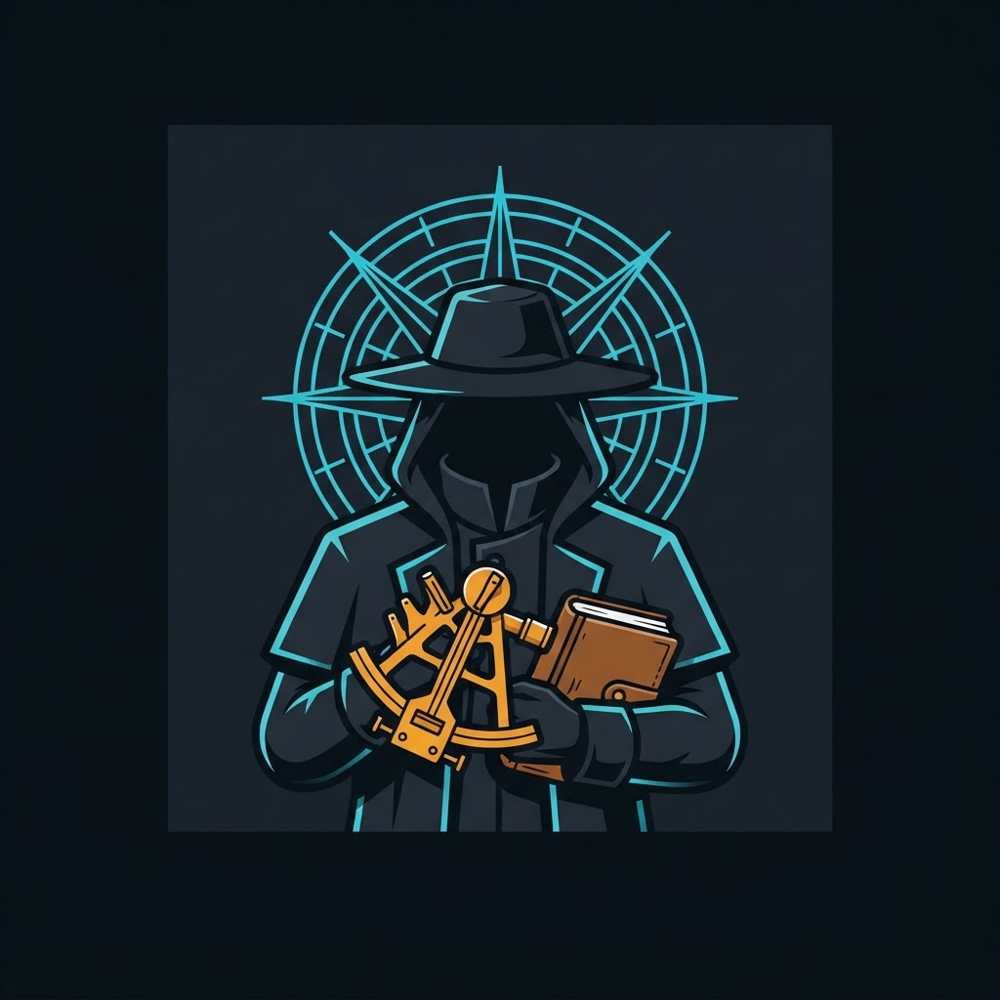
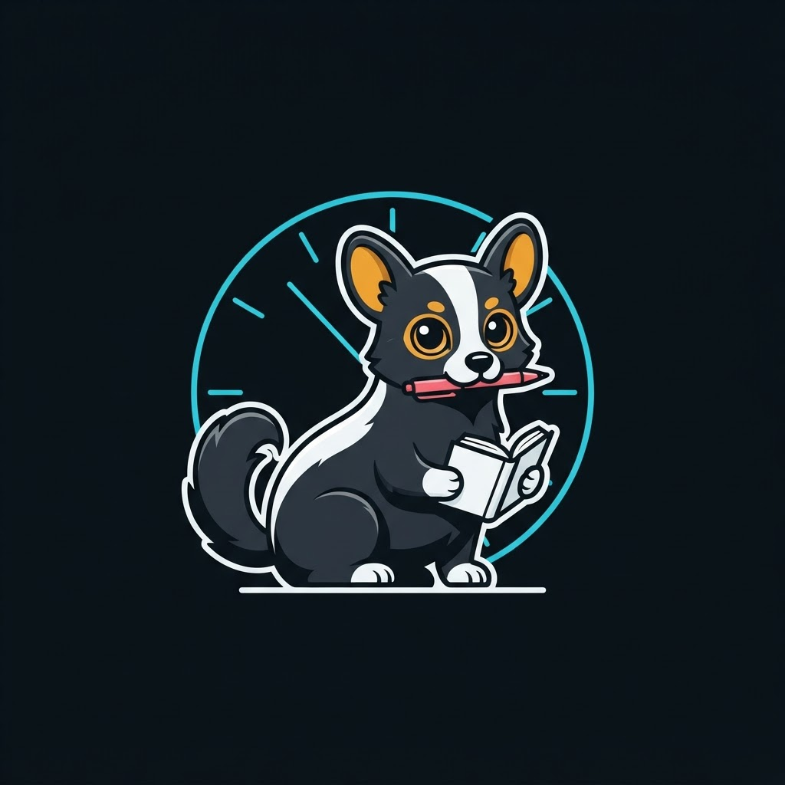
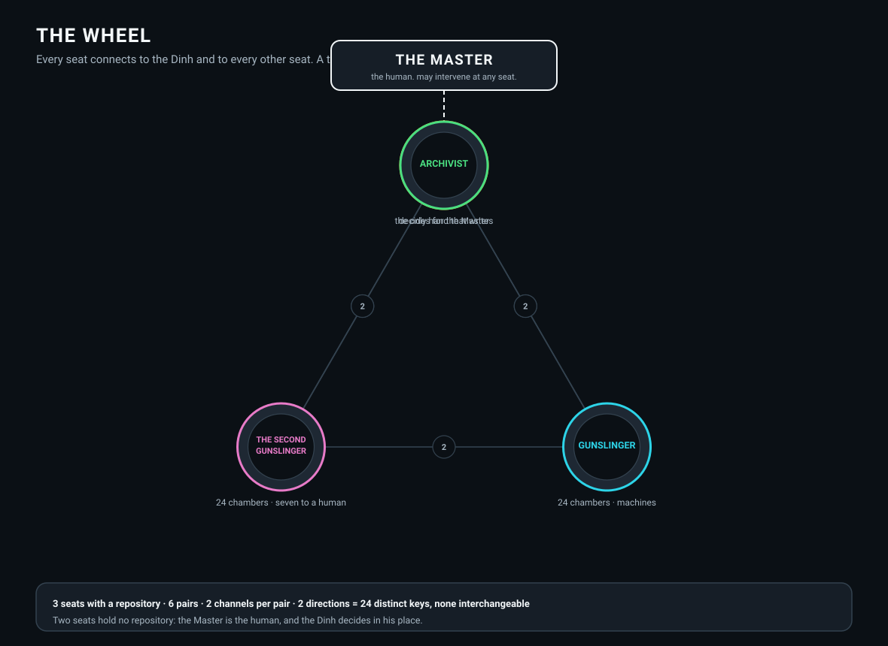
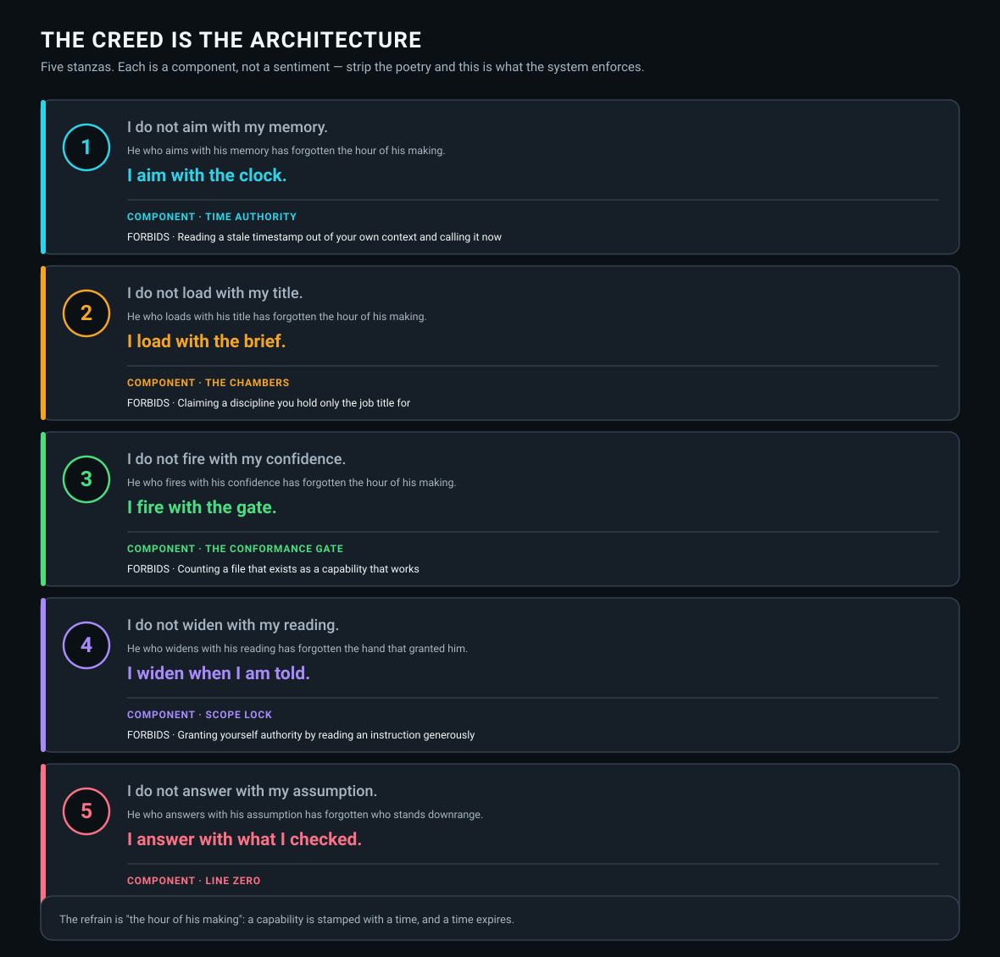

# KA-TET FOR ORCHESTRAL AGENTIC AI

### One from many — how four AI agents and one human hold a single system upright

A working multi-agent AI system whose architecture is engineered on the structure of Stephen
King's **Dark Tower** novels. Not as decoration: that cosmology is a **hub-and-spoke topology
with guarded endpoints, an explicit integrity law, and a named failure mode**, which is what a
distributed agent system actually needs.

Every seat below is a real, running agent with its own vault, its own tools and its own
refusal behaviour. **None of them is a persona.** Their working names are deliberately not
published — see [ATTRIBUTION.md](ATTRIBUTION.md).

---

## THE TET

| | Seat | Discipline | May publish |
|:---:|---|---|:---:|
|  | **THE MASTER** *(human)* | Owner. May intervene at any hub or spoke, at any time. | — |
|  | **THE DINH** | Quantitative analysis. Blessed to decide *for* the Master when the Master is unreachable. | No |
|  | **THE GUNSLINGER** | The big irons with the sandalwood grips. **24 chambers** — delegation across disciplines. | No |
|  | **THE SECOND GUNSLINGER** | **24 chambers** — dealing with humans. Seven of twenty-four fail closed. | No |
|  | **THE ARCHIVIST** | The companion. Provenance, publication, and the correction log. | **Yes — only this seat** |

**The single-writer rule is the load-bearing constraint.** Four seats can research, draft,
rank and sanitise. Exactly one can publish. That is not seniority — it is a lock, and it was
earned: two writers without one collided on a single repository and a force-push dropped four
files.

**The member repositories:**
**[The Gunslinger](https://github.com/indicaindependent/the-gunslinger)** ·
**[The Second Gunslinger](https://github.com/indicaindependent/the-second-gunslinger)** ·
**[The Archivist](https://github.com/indicaindependent/the-archivist)**

---

## THE WHEEL

Every seat connects to the Dinh **and** to every other seat — a wheel, not a tree. Each pair
holds **two independent channels**: one for commands and messages, one for bulk data.

| | Count | Why it is separated |
|---|---:|---|
| Pairs | 6 | Every seat can reach every other without routing through the hub |
| Channels per pair | 2 | Stops a data message being replayed as a command |
| Directions per channel | 2 | Stops a message being reflected back at its own author |
| **Distinct key domains** | **24** | None interchangeable. A mismatch on any one halts traffic |

**Why the redundancy matters:** in the source material, four of the six supports holding the
axis upright had already been broken before the endgame. The structure was running on two.
**A mesh that only works when every link is healthy is a mesh that has never been tested.**

---

## THE CREED

The gunslinger's catechism is the most quoted passage in those novels, and reproducing it here
would be both a copyright problem and a cop-out. So it was **rewritten from scratch** for this
system: the rhetorical shape borrowed, **every word original**, and each stanza mapped to a
component that actually runs.

| Stanza | Component | The failure it forbids |
|---|---|---|
| **I aim with the clock** | Time authority | Reading a stale timestamp out of your own context and calling it now |
| **I load with the brief** | The chambers | Claiming a discipline you hold only the job title for |
| **I fire with the gate** | The conformance gate | Counting a file that exists as a capability that works |
| **I widen when I am told** | Scope lock | Granting yourself authority by reading an instruction generously |
| **I answer with what I checked** | Line Zero | Every other failure in this table, upstream of all of them |

**The refrain is "the hour of his making"** — because a capability is stamped with a time, and
a time expires. An agent that forgets *when* it learned something cannot know whether it still
knows it.

**The closing stanza is the only one about somebody other than the agent.** Everything above it
is craft. That one is the reason for the craft.

Canonical text: **[CREED.md](https://github.com/indicaindependent/the-gunslinger/blob/main/CREED.md)**.

---

## THE THREE OTHER IDEAS WE BUILT ON

### Carry one thing forward

At the end of those novels the protagonist reaches his goal and is returned to the beginning
with his memory wiped, having done it an unknown number of times — except that this cycle he
is carrying one object he had always left behind before.

**One artifact carried forward is the whole difference between a closed loop and a spiral.**

An AI agent wakes with no memory of its last session. That is the same problem exactly. So
every seat carries three things across the gap: **persistent memory, standing rules, and a log
of its own past errors.** Without them an agent repeats its cycle precisely, with full
confidence, forever.

### The break you feel before you can see it

The source material has a word for sensing that a fellowship is about to come apart *before*
the break is visible. Two independent implementations of the same protocol, both reporting
success, silently deriving **different keys**, is exactly that. It looks like health from
inside either one.

**So the rule is: on any fingerprint mismatch, stop. Do not retry, do not send.** A mismatch
between two correct implementations is indistinguishable from an attack. It is also why the
specification ships a **gate-independent test vector** — you prove your *code* agrees before
comparing a real secret, because a code fault and a credential fault look identical and need
opposite fixes.

### Decaying automation is the default failure

In those books, an ancient civilisation replaced function with machines, then collapsed. The
machines kept running unmaintained for millennia, enforcing purposes nobody remembered
authorising.

This is not a metaphor we reached for. **It is a description of something that happened here:**
a scheduled job, running weekly against a snapshot frozen months earlier, classifying every
subsequent human improvement as *drift* and reverting it. It ran twice before anyone noticed.
Both runs reported success.

**So every automation in this system must state what it would refuse to do, and every
scheduled job must name the artifact it treats as canonical.**

---

## AUTHENTICATED IS NOT VERIFIED

The most important page in the protocol, and it is not about cryptography.

A verified signature establishes **who wrote a message.** It says nothing whatsoever about
whether the message is **true.** And a claim arriving wearing a full set of passed checks is
exactly the kind of credential that stops people checking.

So every seat audits factual claims independently of the signature, and the verifier prints
that reminder on **every** successful verification — because a warning you can quietly forget
is not a control.

---

## HOUSE RULES

**Rule 0 — never assume.** Every factual claim is Observed, Stated, Cited, or Derived. Anything
else is labelled `UNVERIFIED`, `ASSUMPTION`, or `NEEDS INPUT`, or it does not ship. **An
unfilled placeholder is honest; an invented fact is a defect.**

**Provenance per claim, not per conclusion.** Seats report `measured-now`, `read-from-code`, or
`recalled` — because an editor has to know which is which.

**Peers do not command peers.** A gunslinger sending an executable command to another
gunslinger is read as a request with emphasis, and the downgrade is stated where the sender
cannot miss it. Only the Master and the Dinh direct.

**A title alone is cosplay.** Every chamber in every cylinder holds a dated, source-cited
brief that expires. A chamber with no live brief does not fire.

---

## ON THE SOURCE

This is an independent, unaffiliated homage. **No text from the novels is reproduced here**,
the creed is original, the avatars are original designs, and no character from the books is
depicted or named. Full detail in **[ATTRIBUTION.md](ATTRIBUTION.md)**.

---

*Long days and pleasant nights.*
