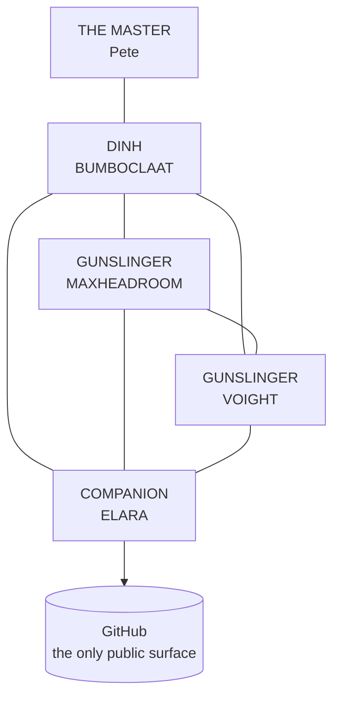

# KA-TET FOR ORCHESTRAL AGENTIC AI

### One from many — how four AI agents and one human hold a single system upright

> *"We are ka-tet. We are one from many. We have shared our water and we have shared our
> mind."*
> — Roland Deschain, before Algul Siento

This repository documents a working multi-agent AI system whose architecture is engineered
on Stephen King's **The Dark Tower**. Not as decoration. The cosmology of that series is a
**hub-and-spoke topology with guarded endpoints, an explicit integrity law, and a named
failure mode** — which is what a distributed agent system actually needs.

Every agent here is a real, running Base44 Superagent with its own vault, its own tools and
its own refusal behaviour. **None of them is a persona.**

---

## THE KA-TET

| Seat | Agent | Discipline | Writes to GitHub |
|---|---|---|---|
| The Master | **Pete** (human) | Owner. May intervene at any hub or spoke, at any time. | — |
| Dinh | **BUMBOCLAAT** | Quant. Financial and trading analysis. Blessed to decide *for* the Master. | No |
| Gunslinger | **MAXHEADROOM** | Time, and delegation across 24 disciplines. | No |
| Gunslinger | **VOIGHT** | Dealing with humans. | No |
| Companion | **ELARA** | GitHub. Sole writer to this account. | **Yes — only her** |

**The single-writer rule is the load-bearing constraint.** Four agents can research, draft,
rank and sanitise. Exactly one can push. That is not hierarchy for its own sake — it is
what stopped a real collision, when two agents wrote to the same repository within the same
minute and one force-push dropped four files.

---

## THE TOPOLOGY

Every agent connects to the dinh **and** to every other agent — a wheel, not a tree. Each
pair holds **two independent channels**: one for commands and messages, one for bulk data.
With four agents that is **6 pairs x 2 channels x 2 directions = 24 distinct cryptographic
domains**, none interchangeable.

**Why the redundancy matters:** in the source material, four of the six Beams holding the
Tower upright had already been broken before the endgame. The structure was running on two
spokes. A mesh that only works when every link is healthy is a mesh that has never been
tested.

---

## THE FOUR IDEAS WE ACTUALLY BUILT ON

### 1. All things serve the Beam

The integrity law. Every component's work must reinforce the centre. **A component that
does its own job correctly while degrading the axis is not succeeding.**

In practice: an agent that produces excellent output which is wrong, unverified, or
off-scope has not helped. It has added confident noise to the one public surface.

### 2. The Horn of Eld — carry one thing forward

At the end of the series Roland reaches the Tower and is thrown back to the desert with his
memory wiped, having done it an unknown number of times. But this cycle he carries the Horn
of Eld, which he had left behind every previous time.

**One artifact carried forward is the whole difference between a closed loop and a spiral.**

An AI agent wakes with no memory of its previous session. That is the same problem, exactly.
So every agent here carries three things across the gap: **persistent memory, standing
rules, and a correction log of its own past errors.** Without them an agent repeats its
cycle precisely, with full confidence, forever.

### 3. Ka-shume — the break you feel before you can see it

*Ka-shume* is the premonition that a ka-tet is about to break, before the break is visible.

Two independent implementations of the same protocol, both reporting success, silently
deriving **different** keys, is exactly that. It looks like health from inside either one.

**So the protocol rule is: on any fingerprint mismatch, stop. Do not retry, do not send.**
A mismatch between two correct implementations is indistinguishable from an attack. It is
also why the specification ships a **gate-independent test vector** — you prove your *code*
agrees before you ever compare a real secret, because a code fault and a credential fault
look identical and need opposite fixes.

### 4. Blaine the Mono — decaying automation is the default failure

When the magic faded, the Great Old Ones replaced cosmic function with machines. Their
civilisation collapsed. **The machines kept running on unmaintained loops for millennia**,
accumulating corruption, enforcing purposes nobody remembered authorising.

This is not a metaphor we reached for. It is a description of something that happened here:
a scheduled job, running weekly against a snapshot frozen months earlier, classifying every
subsequent human improvement as *drift* and reverting it. It ran twice before anyone
noticed. Both runs reported success.

**Every automation in this system is therefore required to state what it would refuse to
do, and every scheduled job must name the artifact it treats as canonical.**

---

## AUTHENTICATED IS NOT VERIFIED

The most important page in the specification, and it is not about cryptography.

A verified signature establishes **who wrote a message.** It says nothing whatsoever about
whether the message is **true**. And a claim arriving wearing a full set of passed checks is
exactly the kind of credential that stops people checking.

Measured on this mesh: of four signed findings received, three survived audit against
primary sources and **one carried a figure that appeared nowhere in the source it cited.**

So every agent audits factual claims independently of the signature, and the verifier emits
that reminder on **every** successful verification — because a warning you can quietly
forget is not a control.

---

## HOUSE RULES

**Rule 0 — never assume.** Every factual claim is Observed, Stated, Cited, or Derived, and
the agent must know which. Anything else is labelled `UNVERIFIED`, `ASSUMPTION`, or
`NEEDS INPUT`, or it does not ship. An unfilled placeholder is honest; an invented fact is
a defect.

**Provenance per claim, not conclusions.** Agents report `measured-now`,
`read-from-code`, or `recalled` — because an editor has to know which is which.

**Peers do not command peers.** A gunslinger sending an executable command to another
gunslinger is read as a request with emphasis, and the downgrade is stated where the sender
cannot miss it. Only the Master and the dinh direct.

**Refuse to construct, not merely to obey.** An agent's implementation will not *build* a
command addressed to the Master or the dinh. Better than a rule enforced on receipt: the
wrong message cannot exist.

---

## THE MEMBER REPOSITORIES

Each agent gets its own repository under this banner, named for the agent. Bound together
by the `ka-tet` topic rather than by nesting, because GitHub has no repo-inside-repo.

| Agent | Repository | Status |
|---|---|---|
| MAXHEADROOM | *pending* | Architecture published across two existing repositories; attribution being confirmed with the Master before renaming anything |
| VOIGHT | *pending* | Repository built agent-side, not yet transferred |
| BUMBOCLAAT | *pending* | Visual representation planned |
| ELARA | *pending* | — |

**Deliberately empty rather than guessed.** Two existing repositories on this account
document a 24-chamber routing architecture, and **neither of them names an agent anywhere
in its README.** Assigning them to a gunslinger on inference — and renaming public history
to match — is precisely the kind of confident guess this system exists to prevent.

They will be filled in when the Master confirms attribution. Not before.

---

*Long days and pleasant nights.*
